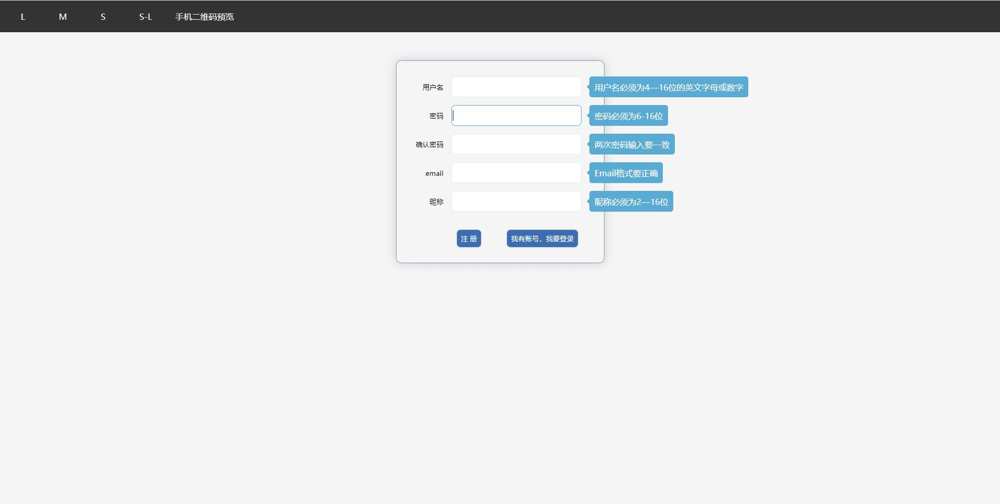
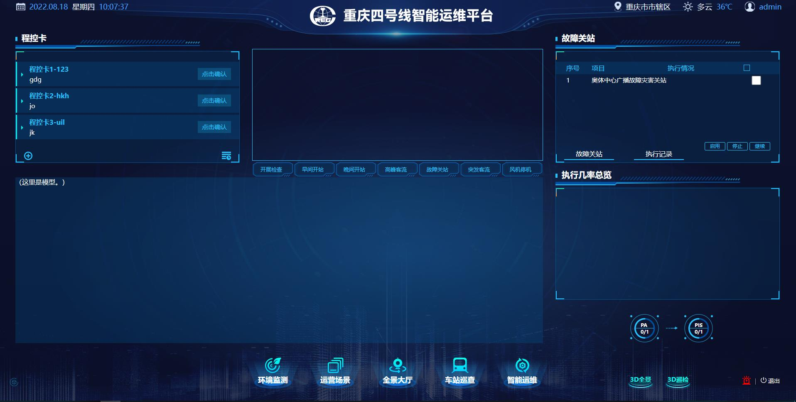

# Summer Intern

This repo records my first summer internship about CS in NARI, Nanjing. 
I am leanring html, CSS, JS ... and there are many friend people helps me a lot.
Although I didn't join in the team work, I still get great progress.

--2022/07/07

## demo1

- html5: 
 
- CSS: flex
- JS: listener(click, focus)

## demo2

- html5: 
 
- CSS3: grid, flex, class, animate
- JS: textContent, array, listener, OOP